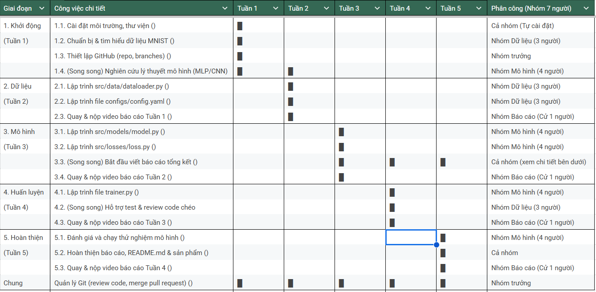

# Digits Classification

# Digits Classification - Phân loại chữ số viết tay (MNIST)

Dự án xây dựng mô hình trí tuệ nhân tạo (AI) đơn giản để nhận diện và phân loại chữ số viết tay từ bộ dữ liệu MNIST. Dự án được thực hiện bằng ngôn ngữ Python và thư viện PyTorch, quản lý môi trường bằng Micromamba.

## Tính năng chính
* Mô hình: Mạng nơ-ron đa lớp (MLP - Multilayer Perceptron).
* Dữ liệu: Tự động tải, xử lý và phân chia bộ dữ liệu MNIST.
* Cấu trúc: Mã nguồn được tổ chức dạng module (src/data, src/models, src/losses).
* Cấu hình: Quản lý tham số huấn luyện tập trung qua file config.yaml.
* Kết quả: Độ chính xác (Accuracy) đạt khoảng 97% - 99% sau 10 epochs.

## Cấu trúc dự án

digits_classification/
├── assets/               # Chứa file model đã huấn luyện (model_final.pth)
├── configs/
│   └── config.yaml       # File cấu hình tham số (Epoch, Batch size...)
├── data/                 # Thư mục chứa dữ liệu MNIST (được Git bỏ qua)
├── src/
│   ├── data/
│   │   └── dataloader.py # Xử lý tải dữ liệu và tạo DataLoader
│   ├── losses/
│   │   └── loss.py       # Định nghĩa hàm mất mát (CrossEntropyLoss)
│   └── models/
│       └── model.py      # Kiến trúc mạng nơ-ron (SimpleMLP)
├── trainer.py            # File script chính để huấn luyện
├── requirements.txt      # Danh sách các thư viện cần cài đặt
└── README.md             # Tài liệu hướng dẫn

## Cài đặt và Môi trường

Dự án yêu cầu Python 3.10 trở lên. Khuyến khích sử dụng Micromamba hoặc Conda để quản lý môi trường.

### 1. Clone dự án
git clone <link-repo-cua-ban>
cd digits_classification

### 2. Tạo môi trường ảo
micromamba create -n digits_classification python=3.10 -y
micromamba activate digits_classification

### 3. Cài đặt thư viện
pip install -r requirements.txt

## Cấu hình (Configuration)

Bạn có thể thay đổi các tham số trong file configs/config.yaml:

train:
  epoch: 10             # Số vòng lặp huấn luyện
  batch_size: 64        # Kích thước lô dữ liệu
  learning_rate: 0.001  # Tốc độ học

data:
  data_dir: "data"      # Tên thư mục lưu dữ liệu

model:
  input_dim: 784        # Đầu vào (28x28 pixel)
  hidden_dim: 128       # Số nơ-ron lớp ẩn
  output_dim: 10        # Đầu ra (10 chữ số)

## Hướng dẫn Huấn luyện

Để bắt đầu huấn luyện mô hình, hãy chạy lệnh sau tại thư mục gốc:

python trainer.py

Quá trình thực hiện:
1. Tự động tải dữ liệu MNIST về thư mục data/ (nếu chưa có).
2. Chia dữ liệu thành 3 tập: Train (60%), Validation (20%), Test (20%).
3. Huấn luyện mô hình qua số lượng Epoch đã định.
4. Lưu mô hình tốt nhất vào thư mục assets/model_final.pth.

## Kết quả Demo

Sau khi huấn luyện xong 10 epochs, kết quả dự kiến:
* Train Accuracy: ~99.40%
* Validation Accuracy: ~97.13%

## Thành viên nhóm

* [Tên bạn] - Trưởng nhóm & Git Master
* [Tên thành viên] - Xử lý dữ liệu
* [Tên thành viên] - Xây dựng mô hình
* ...

---
Đồ án môn Nhập môn Công nghệ Thông tin - Trường Đại học Khoa học Tự nhiên, ĐHQG-HCM